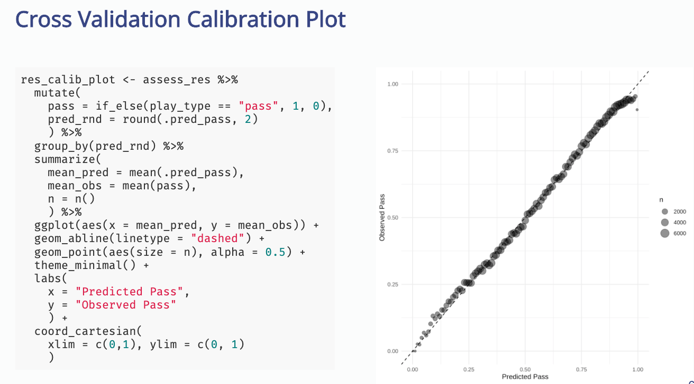

# CMSAC Tidymodels Workshop

This workshop provides a gentle introduction to supervised machine learning: concepts, methods, and R code. Participants will learn how to apply a few common methods on open-source NFL data via nflfastR. Along the way, I'll introduce several core tidymodels packages, which provide a grammar for modeling that makes it easy to do the right thing, and harder to accidentally do the wrong thing.

Slides at [cmsac-tidymodels.netlify.app](https://cmsac-tidymodels.netlify.app/#1)

